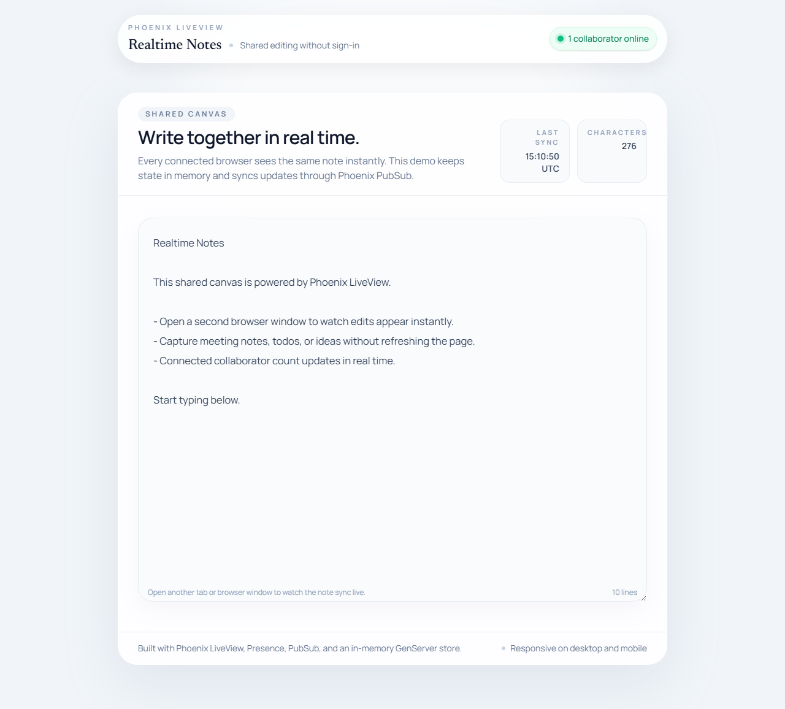
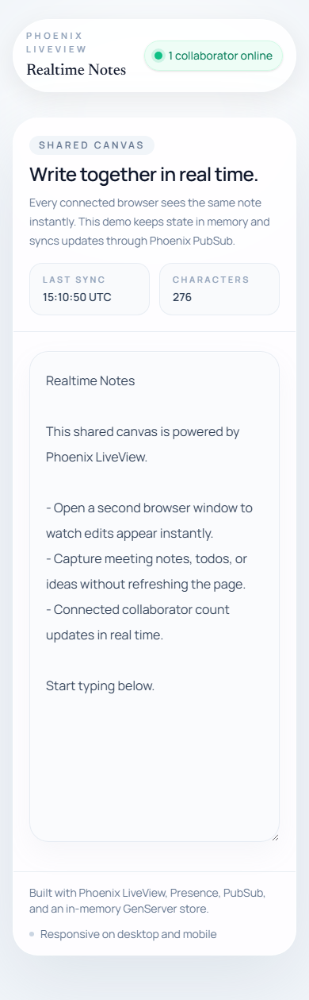

# realtime_notes_elixir

Phoenix LiveView로 만든 미니멀한 실시간 협업 노트 에디터입니다. 로그인 없이 접속한 모든 사용자가 같은 문서를 함께 편집할 수 있고, 연결된 사용자 수가 즉시 반영됩니다.


## 1. 프로젝트 소개

`realtime_notes_elixir`는 "한 장의 공유 노트"라는 단순한 문제를 Phoenix LiveView의 강점으로 풀어낸 프로젝트입니다. 별도의 프런트엔드 SPA 없이도 브라우저 여러 개가 같은 textarea를 동시에 편집할 수 있고, 서버가 문서 상태와 접속 상태를 함께 관리합니다.

## 2. 데모 설명

앱에 접속하면 연한 회색 배경 위에 중앙 정렬된 화이트 에디터 카드가 나타납니다. 상단에는 프로젝트 이름과 현재 접속 중인 사용자 수가 표시되고, 본문에는 모든 사용자가 함께 수정하는 단일 노트 편집 영역이 배치됩니다.

기대되는 사용 흐름은 다음과 같습니다.

- 첫 화면에서 실시간 협업 상태를 보여 주는 헤더 확인
- 하나의 공유 textarea에 메모 입력
- 다른 브라우저나 탭에서 같은 페이지를 열고 실시간 동기화 확인
- 마지막 동기화 시각, 문자 수, 줄 수 같은 보조 정보 확인

## 3. 스크린샷

### 데스크톱 화면



### 모바일 화면



## 4. 기술 스택

- Phoenix 1.8.5
- Phoenix LiveView 1.1
- Phoenix.PubSub
- Phoenix.Presence
- Elixir GenServer
- Tailwind CSS 4
- Bandit

## 5. 아키텍처 개요

이 프로젝트는 `RealtimeNotesElixir.Notes`라는 단일 GenServer가 공유 노트의 현재 상태를 메모리에 보관하는 구조입니다. 사용자가 입력할 때마다 LiveView 이벤트가 서버로 전달되고, 이 프로세스가 최신 노트 본문과 갱신 시각을 저장한 뒤 PubSub로 변경 사실을 브로드캐스트합니다.

화면은 `NoteLive`가 담당합니다. 각 사용자가 페이지에 접속하면 같은 LiveView를 마운트하고, 공용 PubSub 토픽을 구독해서 다른 사용자의 편집 결과를 즉시 반영합니다. 따라서 별도 REST polling이나 복잡한 클라이언트 상태 동기화 없이도 실시간 협업 경험을 만들 수 있습니다.

접속자 수는 Phoenix Presence로 관리합니다. 사용자가 연결되면 Presence 토픽에 추적 정보가 등록되고, 연결이 끊기면 자동으로 빠지기 때문에 인증 없이도 현재 협업 인원 수를 안정적으로 계산할 수 있습니다.

## 6. 주요 기능

- 단일 공유 textarea 기반 실시간 협업 편집
- 여러 브라우저 간 즉시 동기화
- 현재 접속자 수 실시간 표시
- GenServer 기반 인메모리 저장소
- 미니멀하고 반응형인 Notion 스타일 UI
- 포커스와 호버에 대한 부드러운 인터랙션
- 저장소 로직과 LiveView 동기화를 검증하는 테스트 포함

## 7. 이 프로젝트가 흥미로운 이유

이 프로젝트는 "실시간 협업"을 무거운 프런트엔드 프레임워크 없이도 구현할 수 있다는 점을 보여 줍니다. LiveView, PubSub, Presence, OTP 프로세스라는 Phoenix 생태계의 기본 구성만으로도 꽤 설득력 있는 협업 제품 경험을 만들 수 있다는 점이 엔지니어링 관점에서 매력적입니다.

또한 의도적으로 인메모리 저장 방식을 선택했기 때문에, 현재 설계가 어디까지 단순하고 어디서부터 확장 포인트가 생기는지 설명하기 좋습니다. 면접이나 포트폴리오 리뷰에서 "여기서 영속 저장, 룸 분리, 충돌 해결을 어떻게 확장할 것인가"를 자연스럽게 이야기할 수 있는 구조입니다.

## 8. 실행 방법

### 사전 준비

- Elixir 1.17 이상
- Erlang/OTP 27 이상

### 로컬 실행

```bash
mix deps.get
mix phx.server
```

브라우저에서 [http://localhost:4000](http://localhost:4000) 으로 접속하면 됩니다.

### 검증 명령

```bash
mix test
mix precommit
```

## 9. 향후 개선 아이디어

- Postgres 또는 Redis 기반 영속 저장소 추가
- 여러 개의 노트 룸 지원
- 협업 충돌 완화를 위한 OT 또는 CRDT 접근 검토
- 접속자 아바타, 타이핑 인디케이터 같은 Presence UI 확장
- 배포 설정과 관측성(로그, 메트릭) 보강
- 공유 링크, 읽기 전용 모드, 히스토리 기능 추가
